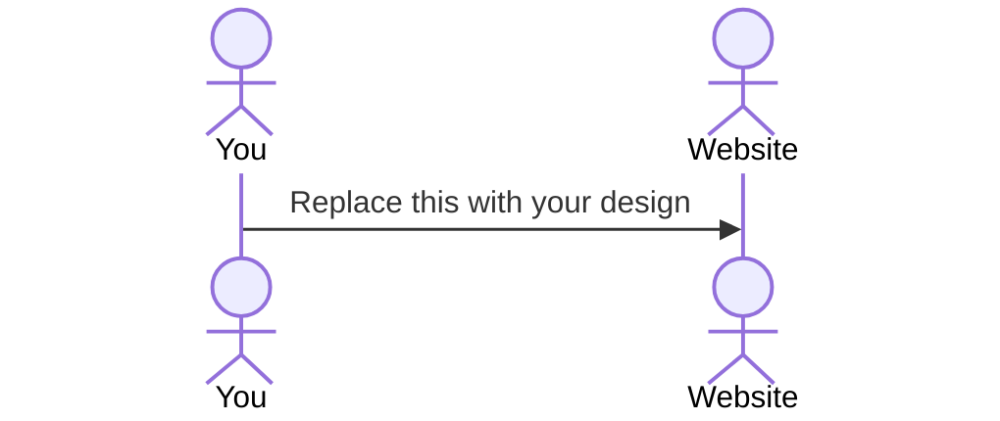

# Subscription Manager

This application is meant to help with monthly subscriptions, so that one doesn't get lost in their subcription finances. A user will be able to see a list view of all their subscriptions and have teh ability to delete a subscription or add one. When adding a subscription, a user will be prompted to input the frequency, fixed billing amount, billing period, next charge date, category, and notes. The user will also be able to view a spending summary across all subscriptions, with a recurring billing simulation. This application will also include free trial tracking, where a user can input a free trial that they signed up for, and will notify the user a couple days before the firee trial expires.

## 🚀 Specification Deliverable

For this deliverable I did the following. I checked the box `[x]` and added a description for things I completed.

- [x] Proper use of Markdown
- [x] A concise and compelling elevator pitch
- [x] Description of key features
- [x] Description of how you will use each technology
- [x] One or more rough sketches of your application. Images must be embedded in this file using Markdown image references.

### Elevator pitch

Don't you just love having the ability to have numerous streams of media all at the access of your hands through subscriptions, however may feel the overbearing weight of not knowing how much it is all costs? Or wonder if you are still paying for a subscription that you stopped using months or years ago? The Subscription Tracker appliaction makes it vary easy to track your subscription expenses and organize them all into one place. Allowing you to centralize subscription tracking, calculate true monthly costs, while also sending reminders for trials and renewals. This easily converts a blind spot in finances to a simple instrument board.

### Design

Lorem ipsum dolor sit amet, consectetur adipiscing elit, sed do eiusmod tempor incididunt ut labore et dolore magna aliqua. Ut enim ad minim veniam, quis nostrud exercitation ullamco laboris nisi ut aliquip ex ea commodo consequat. Duis aute irure dolor in reprehenderit in voluptate velit esse cillum dolore eu fugiat nulla pariatur. Excepteur sint occaecat cupidatat non proident, sunt in culpa qui officia deserunt mollit anim id est laborum.

### Key features

- Login using HTTPS
- Ability to edit, add to, or remove from the subscription dashboard
- Display the dashboard
- Calculate teh monthly expenses
- Notifications about what subscriptions are upcoming
- Abiity to input a free trial
- Ability to sort by category

### Technologies

I am going to use the required technologies in the following ways.

- **HTML** - This will help give structure. 5 pages of html: the dashboard, editing the dashboard, adding a subscription, deleting a subscription, editing a subscription
- **CSS** - Used in the overall look of the interface. Different uses of color and whitespace, to make the application look appealing. It will also be used in sizing the diffrent interactive features of the application.
- **React** - Used to allow the user to input edits, login, choose an edit, add a subscription and its corresponding information, delete a subscription, navigate back to the dashboard, and make edits to a subscription.
- **Service** - Included endpoints are: login, the dashboard, choosing an edit, retrieving information for a new subscription, deleting a subscription, and editing a subscription
- **DB/Login** - Stores the user with subscriptions and its corresponding information. Registers the user and saves the data in the database.
- **WebSocket** - The data will be displayed back to the user in the dashboard with its corresponding elements, and included in the calculation for monthly expenses.

## 🚀 AWS deliverable

For this deliverable I did the following. I checked the box `[x]` and added a description for things I completed.

- [ ] **Server deployed and accessible with custom domain name** - [My server link](https://yourdomainnamehere.click).

## 🚀 HTML deliverable

For this deliverable I did the following. I checked the box `[x]` and added a description for things I completed.

- [ ] **HTML pages** - I did not complete this part of the deliverable.
- [ ] **Proper HTML element usage** - I did not complete this part of the deliverable.
- [ ] **Links** - I did not complete this part of the deliverable.
- [ ] **Text** - I did not complete this part of the deliverable.
- [ ] **3rd party API placeholder** - I did not complete this part of the deliverable.
- [ ] **Images** - I did not complete this part of the deliverable.
- [ ] **Login placeholder** - I did not complete this part of the deliverable.
- [ ] **DB data placeholder** - I did not complete this part of the deliverable.
- [ ] **WebSocket placeholder** - I did not complete this part of the deliverable.

## 🚀 CSS deliverable

For this deliverable I did the following. I checked the box `[x]` and added a description for things I completed.

- [ ] **Visually appealing colors and layout. No overflowing elements.** - I did not complete this part of the deliverable.
- [ ] **Use of a CSS framework** - I did not complete this part of the deliverable.
- [ ] **All visual elements styled using CSS** - I did not complete this part of the deliverable.
- [ ] **Responsive to window resizing using flexbox and/or grid display** - I did not complete this part of the deliverable.
- [ ] **Use of a imported font** - I did not complete this part of the deliverable.
- [ ] **Use of different types of selectors including element, class, ID, and pseudo selectors** - I did not complete this part of the deliverable.

## 🚀 React part 1: Routing deliverable

For this deliverable I did the following. I checked the box `[x]` and added a description for things I completed.

- [ ] **Bundled using Vite** - I did not complete this part of the deliverable.
- [ ] **Components** - I did not complete this part of the deliverable.
- [ ] **Router** - I did not complete this part of the deliverable.

## 🚀 React part 2: Reactivity deliverable

For this deliverable I did the following. I checked the box `[x]` and added a description for things I completed.

- [ ] **All functionality implemented or mocked out** - I did not complete this part of the deliverable.
- [ ] **Hooks** - I did not complete this part of the deliverable.

## 🚀 Service deliverable

For this deliverable I did the following. I checked the box `[x]` and added a description for things I completed.

- [ ] **Node.js/Express HTTP service** - I did not complete this part of the deliverable.
- [ ] **Static middleware for frontend** - I did not complete this part of the deliverable.
- [ ] **Calls to third party endpoints** - I did not complete this part of the deliverable.
- [ ] **Backend service endpoints** - I did not complete this part of the deliverable.
- [ ] **Frontend calls service endpoints** - I did not complete this part of the deliverable.
- [ ] **Supports registration, login, logout, and restricted endpoint** - I did not complete this part of the deliverable.

## 🚀 DB deliverable

For this deliverable I did the following. I checked the box `[x]` and added a description for things I completed.

- [ ] **Stores data in MongoDB** - I did not complete this part of the deliverable.
- [ ] **Stores credentials in MongoDB** - I did not complete this part of the deliverable.

## 🚀 WebSocket deliverable

For this deliverable I did the following. I checked the box `[x]` and added a description for things I completed.

- [ ] **Backend listens for WebSocket connection** - I did not complete this part of the deliverable.
- [ ] **Frontend makes WebSocket connection** - I did not complete this part of the deliverable.
- [ ] **Data sent over WebSocket connection** - I did not complete this part of the deliverable.
- [ ] **WebSocket data displayed** - I did not complete this part of the deliverable.
- [ ] **Application is fully functional** - I did not complete this part of the deliverable.
